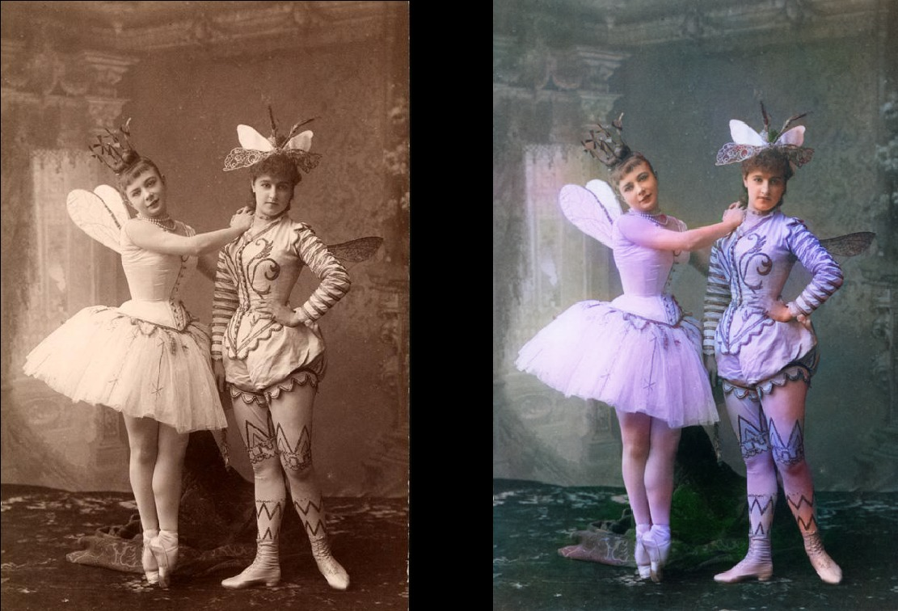
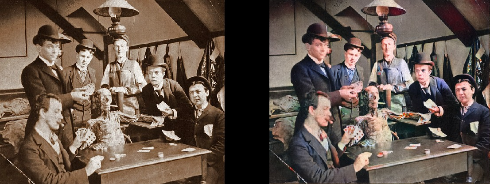
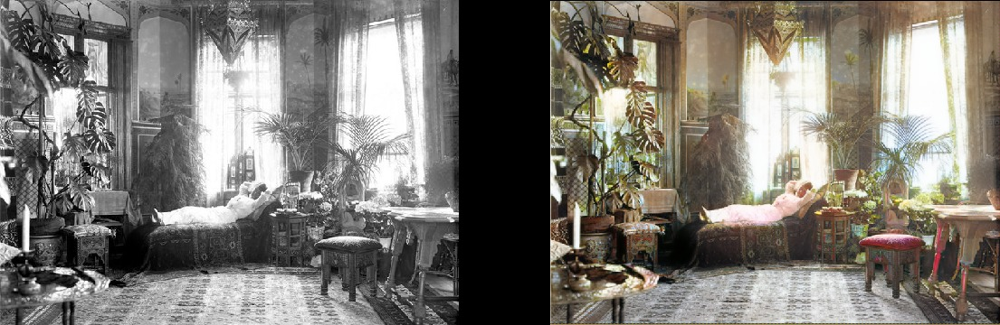

### 项目简介

照片承载了很多人在某个时刻的记忆，尤其是一些老旧的黑白照片，尘封于脑海之中，随着时间的流逝，记忆中对当时颜色的印象也会慢慢消散，这确实有些可惜。

技术的发展会解决一些现有的难题，深度学习恰好能够解决这个问题。

### 项目结果

玛丽亚安德森饰演仙女芙蓉和蕾巴夫拉娃作为她在1890年在俄罗斯圣彼得堡皇家剧院芭蕾舞剧“睡美人”的页面。

医学生在1890年左右与尸体一起摆姿势。

放松在她的客厅的妇女（1920年，瑞典）

### 技术细节

1、数据

[MIT地点数据集](http://places.csail.mit.edu/)中的一个子集，该子数据集包含地点、景观和建筑物。

2、工具

PyTorch构建和训练搭建的模型。

torchvision处理图像和视频。

scikit-learn用于在RGB和LAB颜色空间之间进行转换。

  3、模型

模型采用卷积神经网络构建而成，与传统的卷积神经网络模型类似，首先应用一些卷积层从图像中提取特征，然后将反卷积层应用于高级（增加空间分辨率）特征。

具体来说，模型采用的是迁移学习的方法，基础是ResNet-18模型，ResNet-18网络具有18层结构以及剩余连接的图像分类网络层。我们修改了该网络的第一层，以便它接受灰度输入而不是彩色输入，并且切断了第六层后面的网络结构。

